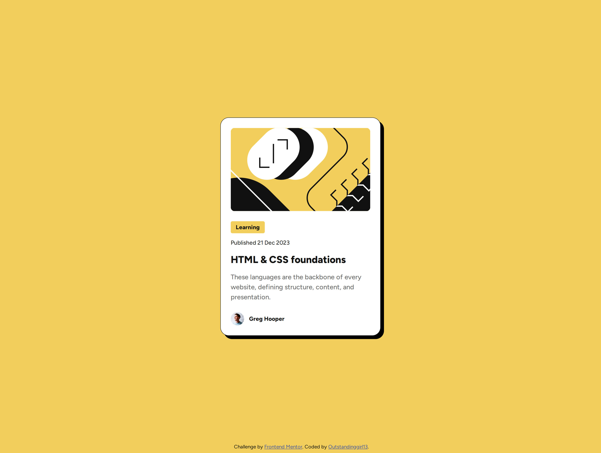

# Frontend Mentor - Blog preview card solution

This is a solution to the [Blog preview card challenge on Frontend Mentor](https://www.frontendmentor.io/challenges/blog-preview-card-ckPaj01IcS). Frontend Mentor challenges help you improve your coding skills by building realistic projects. 

## Table of contents

- [Overview](#overview)
  - [The challenge](#the-challenge)
  - [Screenshot](#screenshot)
  - [Links](#links)
- [My process](#my-process)
  - [Built with](#built-with)
  - [What I learned](#what-i-learned)
  - [Useful resources](#useful-resources)
- [Author](#author)

## Overview

### The challenge

Users should be able to:

- See hover and focus states for all interactive elements on the page

### Screenshot



### Links

- Solution URL: [Add solution URL here](https://your-solution-url.com)
- Live Site URL: [GitHub Pages](https://outstandinggirl13.github.io/blog-preview-card/)

## My process

### Built with

- Semantic HTML5 markup
- CSS custom properties
- Flexbox
- Mobile-first workflow

### What I learned

This time, I had the chance to work with a Figma design file provided in the Frontend Mentor challenge. It was a huge help in positioning and styling elements to achieve pixel-perfect accuracy.

I’ll be working with Figma design files a lot, so I want to note down the most essential shortcuts [1]:

- Zoom in/out: Ctrl + Scroll (Windows)
- Pan canvas: Spacebar + Drag
- Zoom to selection: Shift + 2
- Zoom to fit: Shift + 1
- 100% Zoom: Shift + 0
- Select nested elements: Ctrl + Click
- Measure distance between elements: Alt + Hover over the element

Regarding my learning process, I feel like my coding skills are improving, and I'm starting to better understand how to apply elements effectively. Now that I’m familiar with the BEM methodology [2], I give elements more meaningful and descriptive names. 

The development process went smoothly overall, but I did encounter a couple of issues with styling the preview image. What helped me achieve the desired result was wrapping the image in a container with a defined width and applying `overflow: hidden;` to ensure the image stays within the container's borders. Additionally, I used `display: flex; justify-content: center;` on the container to center the image perfectly and crop it evenly on the left and right sides.

I'm also pleased with how I handled the transition between the mobile and desktop versions. As you adjust the viewport width, the main element's width dynamically changes using the following clamp function:

```css
    .blog-preview {
        max-width: 384px;
        width: clamp(20.5rem, 18.9800796812749rem + 5.577689243027888vw, 24rem);
    }
```

The minimum size of the main element is `20.5rem` (`328px`) and the maximum is `24rem` (`384px`). This means the main element adjusts within the range of `20.5rem` to `24rem` as the viewport changes from `27.25rem` (`436px`) to `90rem` (`1440px`).

The last thing I’d like to mention is that the design includes a publication date within the blog-preview element, so I decided it would be useful to wrap it in a machine-readable HTML element like this:

```html
    <time datetime="2023-12-21">21 Dec 2023</time> 
```

The code above ensures that the date is both human-readable and machine-accessible [3].


### Useful resources

- [Figma for developers: How to work with a design file](https://www.frontendmentor.io/articles/figma-for-developers-how-to-work-with-a-design-file-m6CZKZ1rC1) - This article outlines how to work with a design file to build more accurate projects.
- [Naming convention](https://en.bem.info/methodology/naming-convention/) - This article explains how to write class names following the BEM methodology.
- [HTML `<time>` Tag](https://www.geeksforgeeks.org/html-time-tag/) - A guide on when to implement the <time> tag.

## Author

- Website - [Outstandinggirl13](https://github.com/Outstandinggirl13)
- Frontend Mentor - [@Outstandinggirl13](https://www.frontendmentor.io/profile/Outstandinggirl13)